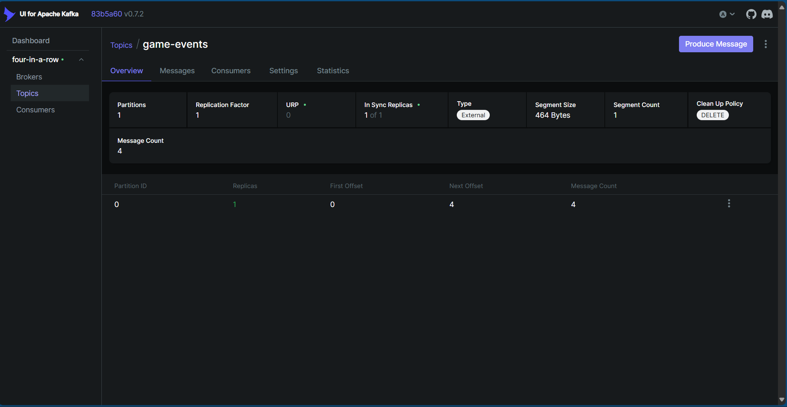
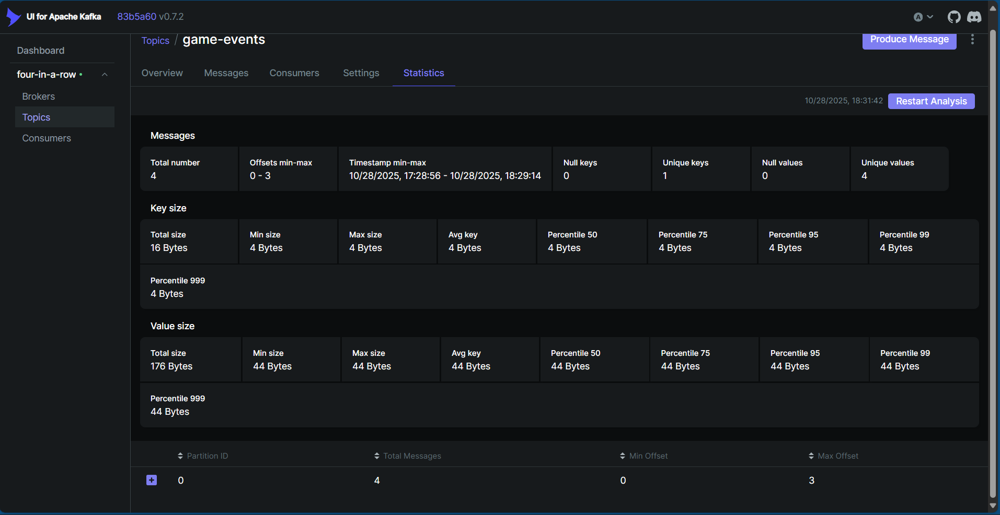
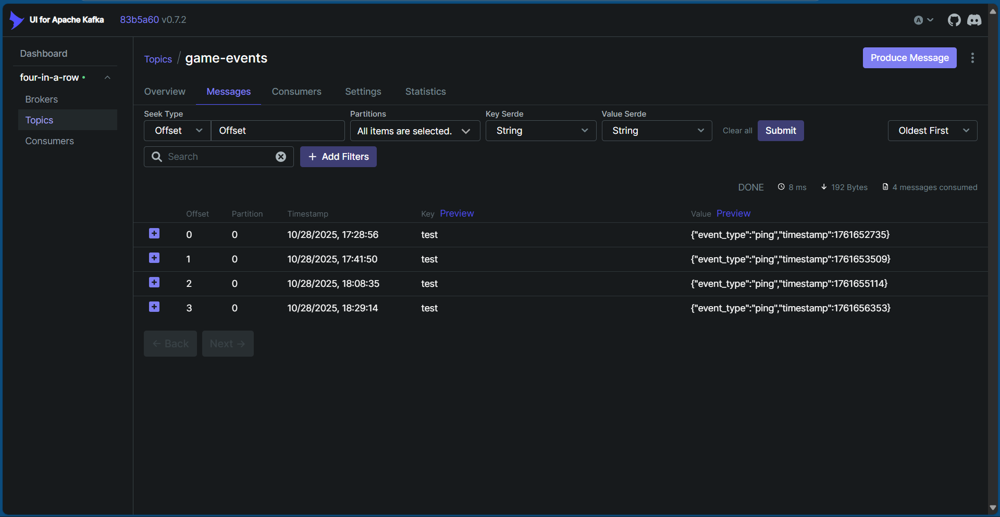

# Kafka Proof Screenshots Guide

## For GitHub Submission

To prove Kafka is working in your project, take these screenshots:

## Screenshot 1: Kafka UI - Topics View
**URL**: http://localhost:8090


1. Start all services: `docker-compose up -d`
2. Open http://localhost:8090 in browser
3. Click on "Topics" in left sidebar
4. You'll see "game-events" topic
5. **Screenshot this page** showing:
   - Topic name: "game-events"
   - Number of partitions
   - Number of messages

## Screenshot 2: Kafka UI - Messages View
**URL**: http://localhost:8090/ui/clusters/four-in-a-row/topics/game-events/messages

1. Click on "game-events" topic
2. Click "Messages" tab
3. Play a game first to generate events (Frontend: http://localhost:3000)
4. Refresh messages view
5. **Screenshot this page** showing:
   - JSON messages with `event_type`, `game_id`, `timestamp`
   - Events like: "game_started", "move", "game_ended"
   - Real event data flowing through Kafka

## Screenshot 3: Kafka UI - Consumer Groups
**URL**: http://localhost:8090/ui/clusters/four-in-a-row/consumers

1. Click "Consumers" in left sidebar
2. You'll see "analytics-group" consumer
3. **Screenshot this page** showing:
   - Consumer group name
   - Topics subscribed (game-events)
   - Lag metrics (should be 0 or low)

## Screenshot 4: Docker Containers Running

```powershell
docker-compose ps
```

**Screenshot terminal output** showing:
- four-in-a-row-kafka (running)
- four-in-a-row-kafka-ui (running)
- four-in-a-row-analytics (running)
- four-in-a-row-zookeeper (running)

## Screenshot 5: Analytics Logs

```powershell
docker-compose logs analytics --tail=50
```

**Screenshot terminal output** showing:
- "Starting analytics service..."
- "Processing event: game_started"
- "Processing event: move"
- "Processing event: game_ended"

## Screenshot 6: Database Records

```powershell
docker-compose exec db psql -U postgres -d four_in_a_row -c "SELECT event_type, COUNT(*) FROM game_analytics GROUP BY event_type;"
```

**Screenshot terminal output** showing:
- Table with event counts
- game_started: X
- move: Y
- game_ended: Z

---

## Quick Test to Generate Events

1. Open frontend: http://localhost:3000
2. Enter username and click "Join Game"
3. Wait for bot opponent (10 seconds)
4. Make 4-5 moves
5. Win or lose the game
6. Now check Kafka UI - you'll see ~10-15 new messages!

---

## What Each Screenshot Proves

| Screenshot | Proves |
|------------|--------|
| Kafka UI Topics | Kafka broker is running and topic exists |
| Kafka UI Messages | Events are being sent to Kafka in real-time |
| Kafka UI Consumers | Analytics service is consuming from Kafka |
| Docker PS | All Kafka infrastructure containers running |
| Analytics Logs | Events are being processed by consumer |
| Database Query | Consumed events are stored (end-to-end proof) |

---

## Add to GitHub README

Include these screenshots in your README with captions:

```markdown
## Kafka Integration Proof

### Kafka UI - Live Event Streaming

*Screenshot showing game-events topic in Kafka*

### Real-time Messages

*Live game events flowing through Kafka (game_started, move, game_ended)*

### Analytics Consumer

*Analytics service consuming events from Kafka*
```

---

## Alternative: Record a Video

Instead of screenshots, you can record a short video:

1. Show Kafka UI at http://localhost:8090
2. Navigate to game-events topic messages (empty)
3. Play a game at http://localhost:3000
4. Return to Kafka UI and refresh
5. Show new messages appearing with actual game data

This is **even better proof** that Kafka is working in real-time!

---

## Summary

**Easiest Proof**: Just open http://localhost:8090 and take a screenshot of the messages tab showing JSON events. This alone proves:
- Kafka is running
- Events are being produced by backend
- Messages are stored in Kafka topic
- Data is flowing through the system

No complex commands needed - it's all visual in the web interface! ✨
